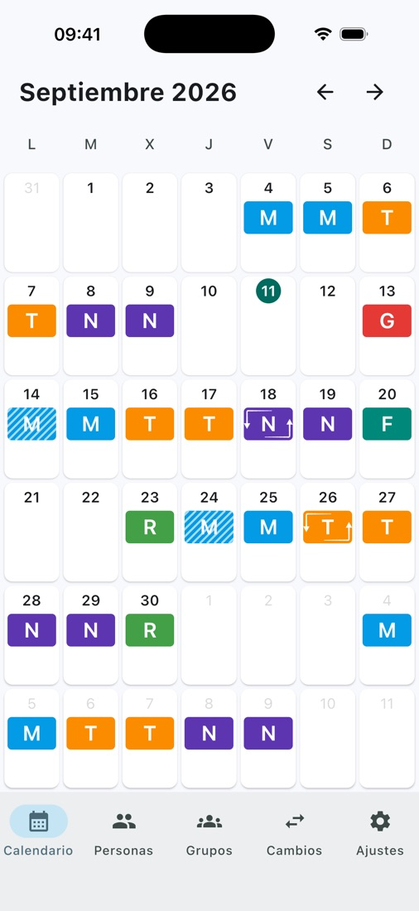
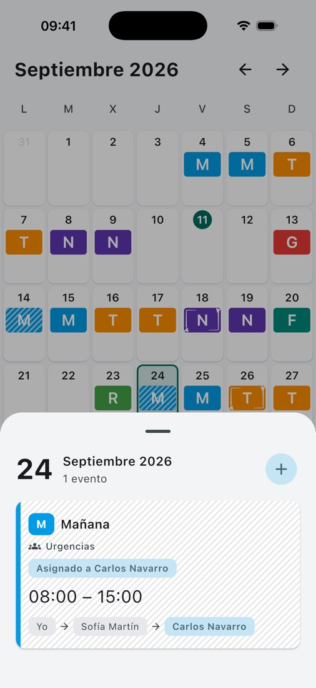

# Turnia

[](https://github.com/Georgevik/turnia/actions/workflows/android-e2e.yml)
[](https://github.com/Georgevik/turnia/releases/latest)
[](LICENSE)

Shift management and swapping for healthcare teams, on Android and iOS.

## The problem

Shift swaps are usually arranged over WhatsApp, and chained swaps (A → B → C) make it easy to lose
track of who actually covers a shift. Turnia keeps a single source of truth for every shift and an
append-only history of every transfer, so the chain can always be traced.

- **Groups** with their own event types, invitation links and join requests.
- **Swaps**: offer a shift, let a colleague take it, and give it back if needed.
- **Shared calendars** between colleagues, across groups.
- **Personal events** alongside group shifts.
- **Push notifications** for everything that affects your schedule.
- Free with **AdMob** banners (behind Google's consent message in the EEA), with premium
  subscriptions planned.

## Screenshots

<!-- TODO: refresh these from store/screenshots/generate.py before making the repo public -->

<p align="center">
  
  
</p>

## Architecture

```
+-----------------------+     +-----------------------+
|   Android (Compose)   |     |   iOS (Compose Mult.)  |
+-----------+-----------+     +-----------+-----------+
            |                             |
            +--------------+--------------+
                           |
                 app/shared (Compose UI)
                           |
                        core (KMP)
        domain, data, Outcome<T,E> error handling
                           |
              GitLive Firebase Kotlin SDK
                           |
        +------------------+------------------+
        |          |            |             |
   Firestore   Auth / App   Cloud Functions   FCM
  (data, rules)   Check      (TypeScript)   (push)
```

No custom backend: Firestore, Auth, Cloud Functions, FCM, Remote Config and Hosting are the whole
server side, called from shared Kotlin code through the GitLive SDK. Business logic that must not
run on the client (joining a group, taking a shift, sending push, verifying a subscription receipt,
purging old events) lives in Cloud Functions instead.

## How this was built

This app is built with an AI coding agent (Claude Code) directed under an explicit engineering
process, not ad-hoc prompting. The artifacts below are the evidence, not a claim:

- **[`CLAUDE.md`](CLAUDE.md)** — the domain rules, architecture decisions and code conventions that
  govern every change the agent makes, kept in sync with the codebase as it evolves.
- **[`openspec/`](openspec)** — every non-trivial change is a written proposal and spec before it's
  code: see [`openspec/specs`](openspec/specs) for the current capabilities and
  [`openspec/changes/archive`](openspec/changes/archive) for the history of how they got there.
- **[`Outcome<T, E>`](core/src/commonMain/kotlin/com/geoviksoft/turnia/core/system/Outcome.kt)** —
  a typed-error result type used instead of exceptions across the domain layer, so the UI maps every
  failure exhaustively instead of catching `Throwable`. The reasoning is documented in `CLAUDE.md`.
- **[Firestore cost audit](firebase/firestore-usage.md)** — every read and write is instrumented
  ([`FirestoreUsageMetrics.kt`](core/src/commonMain/kotlin/com/geoviksoft/turnia/core/data/datasource/firestore/analytics/FirestoreUsageMetrics.kt)),
  so the cost of a feature is measured per action, not guessed after the Firebase bill arrives.
- **68 end-to-end happy paths** ([`app/androidApp/src/androidTest`](app/androidApp/src/androidTest))
  run against real Firebase emulators — the offer → take → A→B→C chain, give-backs, revoked members,
  shared calendars — and gate every release.
- **CI/CD**: the [Release workflow](.github/workflows/release.yml) builds and uploads both apps only
  after the [E2E suite](.github/workflows/android-e2e.yml) is green.

## Tech stack

- **Kotlin Multiplatform** and **Compose Multiplatform**: shared logic and UI for Android and iOS.
- **Firebase** as the whole backend (Firestore, Auth, Cloud Functions, FCM, Crashlytics, App Check,
  Remote Config, Hosting), used from shared code through the GitLive SDK.
- **Koin**, **Navigation 3**, **Coroutines/Flow**, **kotlinx.serialization**.
- **Google Mobile Ads** and the **User Messaging Platform** for ads and consent.

## Project structure

```
turnia/
├── app/
│   ├── androidApp/   Android entry point
│   ├── shared/       Shared Compose UI (commonMain / androidMain / iosMain)
│   └── iosApp/       iOS entry point (Xcode project, Swift bridges for the Google SDKs)
├── core/             Domain and data layer shared by both apps
├── firebase/         Firestore rules and indexes, Cloud Functions (TypeScript), Hosting
├── openspec/         Specs and change proposals that drive AI-assisted development
├── store/            Store listing texts and screenshot generation
└── .github/          Release pipeline
```

## Status

In closed testing: Android on Play's internal testing track, iOS on TestFlight. Not yet listed
publicly on either store. Firebase App Check attestation is wired into release builds; production
enforcement is being rolled out in stages (see `openspec/changes` for the current rollout).

## Documentation

- [CLAUDE.md](CLAUDE.md): domain concepts, business rules, architecture and code conventions.
- [openspec/specs](openspec/specs): the current capabilities, as written specs.
- [firebase/firestore-schema.md](firebase/firestore-schema.md): collections, fields, security
  rules and invariants.
- [firebase/firestore-usage.md](firebase/firestore-usage.md): expected Firestore cost per action and
  per user.
- [.github/RELEASE.md](.github/RELEASE.md): release pipeline setup.

## License

Source-available for portfolio and demonstration purposes — see [LICENSE](LICENSE). All rights
reserved; no reuse is granted.
